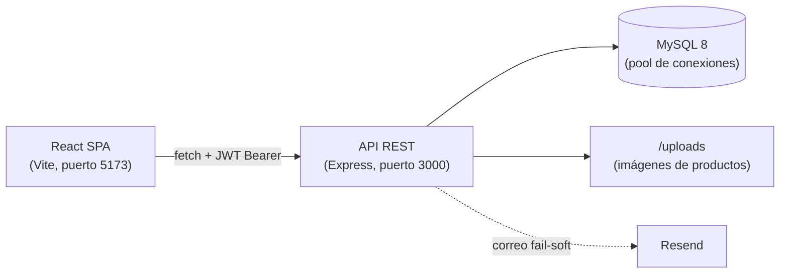

# CommerCity

**Estado:** Proyecto académico en etapa productiva | Backend: 328/328 pruebas OK (22 archivos) | Frontend: 17/17 pruebas OK | Móvil (Capacitor) y Escritorio (Electron): cableados a la API y verificados (capa de red 102/102, RF4 12/12) | Cobertura backend: 92.55% líneas

CommerCity es una plataforma de comercio electrónico para mercados locales con roles de comprador, vendedor y administrador. Incluye catálogo de productos con imágenes, carrito de compras, pedidos, pasarela de pago simulada, tiendas de vendedores, chat, notificaciones, seguidores, calificaciones, reportes de contenido y panel de administración.

## Contexto académico

Proyecto productivo desarrollado en el marco del **SENA**, programa **Tecnólogo en Análisis y Desarrollo de Software (ADSO)**, como alternativa de **Proyecto Productivo** dentro de la **Formación Profesional Integral (FPI)** y la **etapa productiva**. La fuente única de requerimientos es el documento oficial del proyecto (`Commercity 2.0 (optimizado 6)`).

## Características principales

## Arquitectura

Arquitectura cliente-servidor: una SPA de React consume una API REST de Express, que persiste en MySQL y sirve las imágenes subidas como archivos estáticos.


```mermaid
flowchart LR
    A["React SPA<br/>(Vite, puerto 5173)"] -->|"fetch + JWT Bearer"| B["API REST<br/>(Express, puerto 3000)"]
    B --> C[("MySQL 8<br/>(pool de conexiones)")]
    B --> D["/uploads<br/>(imágenes de productos)"]
    B -.->|"correo fail-soft"| E["Resend"]
```

Pipeline de middlewares y flujo de una petición autenticada:

```text
Petición entrante
  -> helmet, CORS (origen único FRONTEND_URL), express.json (límite 10mb)
  -> rate limit: 10 peticiones/min en /api/usuarios/login y /api/usuarios/recover
  -> auth.middleware: JWT Bearer + lista negra en BD (tokens_invalidados, hash SHA-256)
     + verificación de usuarios.activo (fail-closed)
  -> role.middleware: control de acceso RBAC por roles
  -> validate.middleware: validación de entrada con esquemas Zod
  -> controller: lógica de negocio + autorización por ownership
  -> respuesta uniforme { success, data } o errorHandler centralizado
```

## Stack tecnológico

### Backend (`backend/package.json`)

| Tecnología                               | Uso                                  | Versión          |
| ---------------------------------------- | ------------------------------------ | ---------------- |
| Node.js                                  | Runtime                              | 22+              |
| Express                                  | Framework web                        | ^5.2.1           |
| MySQL2                                   | Driver de MySQL (pool de conexiones) | ^3.20.0          |
| jsonwebtoken                             | Autenticación JWT                    | ^9.0.3           |
| Zod                                      | Validación de entrada                | ^4.4.3           |
| Multer                                   | Carga de archivos                    | ^2.2.0           |
| helmet                                   | Cabeceras de seguridad               | ^8.3.0           |
| express-rate-limit                       | Limitación de peticiones             | ^8.6.2           |
| Resend                                   | Correo transaccional                 | ^6.18.1          |
| bcrypt                                   | Hash de contraseñas                  | ^6.0.0           |
| cors / dotenv                            | CORS y variables de entorno          | ^2.8.6 / ^17.3.1 |
| Vitest + supertest + @vitest/coverage-v8 | Pruebas y cobertura                  | ^4.1.10 / ^7.2.2 |

### Frontend (`frontend/package.json`)

| Tecnología                             | Uso                              | Versión                 |
| -------------------------------------- | -------------------------------- | ----------------------- |
| React + React DOM                      | Biblioteca de UI                 | ^19.2.4                 |
| React Router DOM                       | Enrutado SPA                     | ^7.14.2                 |
| Vite                                   | Bundler y servidor de desarrollo | ^8.0.1                  |
| Tailwind CSS (vía @tailwindcss/vite)   | Estilos                          | ^4.2.2                  |
| framer-motion                          | Animaciones                      | ^12.38.0                |
| lucide-react                           | Iconos                           | ^1.8.0                  |
| swiper                                 | Carruseles                       | ^12.1.3                 |
| Vitest + jsdom + React Testing Library | Pruebas                          | 5.0.1 / 30.1.1 / 16.3.3 |

## Estructura del repositorio

```text
COMMER CITY/
├── backend/
│   └── src/server/
│       ├── __tests__/      # 22 archivos de pruebas (Vitest + supertest)
│       ├── config/         # db.js, multer.js, multer.chat.js
│       ├── controllers/    # Controladores por módulo (incluye subcarpeta admin/)
│       ├── middleware/     # auth, error, role, validate
│       ├── routes/         # 12 archivos de rutas por módulo
│       ├── schemas/        # Esquemas Zod de autenticación
│       ├── utils/          # config, crypto, finanzas, mailer, response
│       ├── app.js          # Middlewares globales y montaje de routers
│       └── server.js       # Arranque del servidor (puerto 3000)
├── frontend/
│   ├── src/
│   │   ├── api/            # client.js: cliente HTTP con JWT Bearer
│   │   ├── components/     # Carrito, admin, globales, inicio, perfil, tienda
│   │   ├── constants/      # config.js (API_BASE_URL) y tokens de diseño CSS
│   │   ├── data/
│   │   ├── pages/          # Administrador, Carrito, IniciarSesion, Inicio, Perfil, Tienda
│   │   ├── services/       # Servicios por módulo contra la API
│   │   ├── test/           # setup.js (jsdom)
│   │   └── utils/
│   ├── public/
│   ├── .nvmrc              # Node 22.23.2
│   └── package.json
├── apps/
│   ├── movil/              # Snapshot versionado de la app Capacitor (www/ con api.js de los 69 endpoints)
│   ├── escritorio/         # Snapshot versionado de la app Electron (src/ con api.js)
│   └── README.md           # Builds (APK/EXE), exclusiones y notas de firma (keystore)
├── docs/                   # Requerimientos, entregas, informes y evidencias
│   ├── informes/           # Versionada por excepción (ver .gitignore): PLAN_*, INFORME_RAMA_*, EVIDENCIA_*
│   │   ├── PLAN_INTEGRACION_API_MOVIL_ESCRITORIO_2026-09-27.md
│   │   ├── INFORME_RAMA_{BACKEND,MOVIL,ESCRITORIO}_2026-09-27.md
│   │   ├── EVIDENCIA_E2E_CAPA_RED_2026-09-28.md
│   │   ├── INFORME_ESTADO_INTEGRACION_2026-09-28.md
│   │   └── INFORME_FINAL_SENA_2026-09-25.md
│   ├── CHANGELOG.md        # Bitácora de cambios (fecha real, evidencia y estado)
│   └── AVANCES/            # Fuentes locales de las apps + PRUEBAS (gitignorado)
├── schema_commercity.sql   # Esquema oficial (crea la BD commercity_v2)
├── seed_commercity.sql     # Datos de prueba (usuarios, productos, pedidos)
├── VERSION                 # Versión SemVer del proyecto
└── .gitignore
```

## Rama PREVIEW del repo oficial (pruebas del equipo)

El código para que todo el equipo pruebe el proyecto se publica en la rama **`PREVIEW`** del repositorio oficial: `https://github.com/diegoSerna17/Commercity`.

**Descargar PREVIEW (clon nuevo):**

```bash
git clone -b PREVIEW https://github.com/diegoSerna17/Commercity.git
cd Commercity
```

**Actualizar PREVIEW (clon existente):**

```bash
git checkout PREVIEW
git pull origin PREVIEW
```

> \[!NOTE]
> Si en lugar de clonar el repo oficial añadiste ese remoto manualmente a un clon de ECOMMERCE, el nombre del remoto es el que le hayas puesto (en este proyecto, `commercycity`): usa `git fetch commercycity` y `git pull commercycity PREVIEW`.

Notas:

- `PREVIEW` contiene el código consolidado (backend, frontend, apps, esquema y seed SQL, README) **sin** documentación interna ni artefactos de análisis: se excluyen `docs/`, `graphify-out/`, `Scripts.txt` y `TEST.MD`. Por eso las referencias de este README a `docs/` aplican solo al repositorio ECOMMERCE.
- Las ramas `main` y `master` del repositorio oficial **no se tocan**: las organizan los líderes al finalizar el proyecto.
- La rama no incluye secretos: solo va `backend/.env.example`; cada quien crea su propio `.env`.

## Instalación y ejecución

**Requisitos:** Node.js 22+ (el frontend exige `>=22.22.2`), npm y acceso a una base de datos MySQL 8 (el servidor compartido del equipo o una local).

Los pasos 4 y 5 son opcionales: solo se necesitan si vas a probar la app móvil o la de escritorio.

```bash
# 1. Clonar el repositorio oficial en la rama PREVIEW
git clone -b PREVIEW https://github.com/diegoSerna17/Commercity.git
cd Commercity

# 2. Backend
cd backend
npm ci                        # instala segun package-lock.json (o npm install)
Copy-Item .env.example .env   # completa los valores (ver Configuracion)

# 3. Frontend
cd ../frontend
npm ci                        # o npm install

# 4. App movil (opcional, para probar en el navegador)
cd ../apps/movil
npm ci

# 5. App escritorio (opcional)
cd ../apps/escritorio
npm ci
```

## Configuración

El backend se configura por variables de entorno. Copia la plantilla y completa los valores:

```powershell
Copy-Item backend\.env.example backend\.env     # desde la raiz del repositorio
```

Los datos de conexion a la base de datos (`DB_HOST`, `DB_PORT`, `DB_USER`, `DB_PASSWORD`, `DB_NAME=commercity_v2`) los entrega el lider del equipo. Si prefieres una base local, importa `schema_commercity.sql` y `seed_commercity.sql` (ver Base de datos mas abajo) y usa `DB_HOST=localhost`.

> \[!NOTE]
> Nunca versiones el archivo `.env`: contiene credenciales locales y ya está excluido por `.gitignore`.

| Variable            | Descripción                                                                                                                                                           |
| ------------------- | --------------------------------------------------------------------------------------------------------------------------------------------------------------------- |
| `PORT`              | Puerto del servidor backend. Por defecto 3000.                                                                                                                        |
| `DB_HOST`           | Host de MySQL (por defecto localhost).                                                                                                                                |
| `DB_PORT`           | Puerto de MySQL (por defecto 3306).                                                                                                                                   |
| `DB_USER`           | Usuario de MySQL.                                                                                                                                                     |
| `DB_PASSWORD`       | Contraseña de MySQL.                                                                                                                                                  |
| `DB_NAME`           | Nombre de la base de datos (usa `commercity_v2`, el que crean los scripts SQL del proyecto).                                                                         |
| `JWT_SECRET`        | **Obligatoria.** El servidor no arranca sin ella. Genera una clave aleatoria, por ejemplo: `node -e "console.log(require('crypto').randomBytes(48).toString('hex'))"` |
| `CRYPTO_SECRET_KEY` | Clave para cifrar datos sensibles (cuenta bancaria). Si se omite, se usa `JWT_SECRET` como respaldo.                                                                  |
| `FRONTEND_URL`      | Origen único permitido por CORS y enlaces del correo. Por defecto `http://localhost:5173`.                                                                            |
| `RESEND_API_KEY`    | API key de Resend. Si se omite, el mailer entra en modo simulación.                                                                                                   |
| `RESEND_FROM`       | Remitente del correo. Por defecto `CommerCity <onboarding@resend.dev>`.                                                                                               |

> \[!IMPORTANT]
> El CORS del backend usa una allow-list (`CORS_ORIGINS` en `backend/src/server/app.js`): `FRONTEND_URL` (web, por defecto `http://localhost:5173`) + los orígenes de la WebView de Capacitor (`https://localhost`, `http://localhost`, `capacitor://localhost`) + `null`/`file://` de Electron. Si sirves el frontend en otro origen, agrégalo a esa lista (nunca uses `*`).

En el frontend, la URL de la API se toma de `VITE_API_URL` (archivo `.env` en la raíz de `frontend/`); por defecto apunta a `http://localhost:3000`.

## Ejecución

### Base de datos

El esquema corresponde al diseño oficial del proyecto (documento Commercity 2.0). Tienes dos opciones:

- **Base compartida del equipo:** solo configura las variables `DB_*` en `backend/.env` con los datos que entrega el lider. No importes nada.
- **Base local:** crea la base importando los scripts de la raíz y usa `DB_HOST=localhost` en `backend/.env`:

```powershell
mysql -u root -p < schema_commercity.sql               # crea commercity_v2 con todas las tablas
mysql -u root -p commercity_v2 < seed_commercity.sql   # datos de prueba (usuarios, productos, pedidos)
```

Entre las tablas principales se encuentran: `usuarios`, `productos`, `pedidos`, `detalle_pedidos`, `pagos_simulados`, `carrito_items` y `tokens_invalidados`.

### Backend

```bash
cd backend
npm run dev    # Desarrollo con nodemon (puerto 3000)
npm start      # Ejecución directa con Node
```

Si falta `JWT_SECRET`, el servidor aborta el arranque con un error en consola.

### Frontend

```bash
cd frontend
npm run dev      # Servidor de desarrollo de Vite (http://localhost:5173)
npm run build    # Build de producción
npm run preview  # Servir el build de producción
```

### App móvil (para probar en el navegador)

```bash
cd apps/movil
npm start        # live-server en http://127.0.0.1:8080
```

Abre **`http://127.0.0.1:8080/www/index.html`** (la raíz `/` muestra el listado de archivos porque la app vive en `www/`).

> \[!IMPORTANT]
> `apps/movil/www/api.js` apunta por defecto a `http://10.0.2.2:3000` (loopback del emulador Android). En el navegador de PC o en un dispositivo físico hay que definir `window.COMMERCITY_API_URL` antes de cargar `api.js` (por ejemplo `http://localhost:3000` en PC o la IP-LAN del equipo en un celular). La app de escritorio ya usa `http://localhost:3000`.

### App escritorio (Electron)

```bash
cd apps/escritorio
npm start        # abre la ventana nativa de CommerCity (API en http://localhost:3000)
```

Requiere el backend corriendo. Para generar el instalador: `npm run build` (ver `apps/README.md`).

## Pruebas

Comandos verificados en los `package.json` de cada aplicación:

```bash
# Backend (desde backend/)
cd backend
npm test                # Suite completa
npm run test:coverage   # Suite con cobertura
npm run test:watch      # Modo observador

# Frontend (SIEMPRE desde frontend/)
cd frontend
npm test
npm run test:coverage
npm run test:watch
```

> \[!IMPORTANT]
> Las pruebas del frontend se ejecutan **siempre desde el directorio** **`frontend/`**. Lanzadas desde la raíz del repositorio fallan.

Resultados actuales:

| Suite                           | Comando                   | Resultado                                 |
| ------------------------------- | ------------------------- | ----------------------------------------- |
| Backend (Vitest + supertest)    | `cd backend && npm test`  | 328 pruebas en 22 archivos, todas pasando |
| Frontend (Vitest + jsdom + RTL) | `cd frontend && npm test` | 17 pruebas en 4 archivos, todas pasando   |

Cobertura actual del backend (`npm run test:coverage`, proveedor v8):

| Métrica    | Valor  | Umbral configurado |
| ---------- | ------ | ------------------ |
| Statements | 92.01% | 60%                |
| Branches   | 81.31% | 60%                |
| Functions  | 98.21% | 60%                |
| Lines      | 92.55% | 60%                |

E2E con backend vivo (2026-09-28): runner de los 69 endpoints = **129/129** y capa de red de los `api.js` reales de móvil/escritorio = **102/102** (incluye RF4 recover/reset 12/12). Ver `docs/informes/EVIDENCIA_E2E_CAPA_RED_2026-09-28.md` y `docs/informes/INFORME_ESTADO_INTEGRACION_2026-09-28.md`.

## Documentación de la API

## Roles del sistema

| Rol               | Capacidades generales                                                                                                                                                                                                             |
| ----------------- | --------------------------------------------------------------------------------------------------------------------------------------------------------------------------------------------------------------------------------- |
| **Comprador**     | Explorar el catálogo, buscar productos, gestionar el carrito, crear y pagar pedidos con la pasarela simulada, consultar el historial de compras, chatear, recibir notificaciones, reportar contenido, calificar y seguir tiendas. |
| **Vendedor**      | Publicar y gestionar sus productos con imágenes, administrar su tienda y sus estadísticas, consultar los pedidos de sus productos, responder chats y registrar su cuenta bancaria con datos cifrados.                             |
| **Administrador** | Gestionar usuarios (incluido su estado activo), productos, pedidos, reportes de contenido, estadísticas globales y búsqueda global.                                                                                               |

# Uso académico y créditos

Proyecto con fines exclusivamente educativos, desarrollado como proyecto productivo del **SENA** (programa ADSO) en el marco de la Formación Profesional Integral. Sin licencia comercial. Los requerimientos y entregas del equipo se conservan localmente en `docs/`; el registro de cambios del proyecto está en `informes/CHANGELOG.md`.
