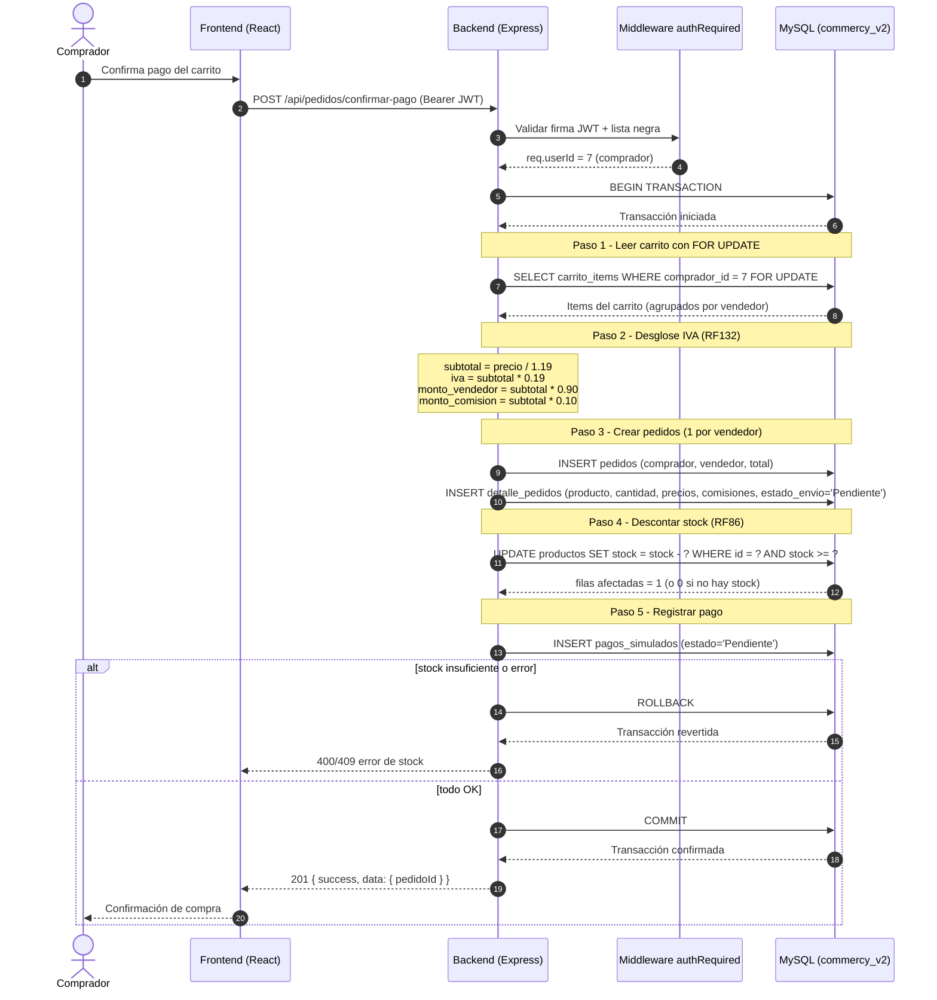

# Diagrama de Secuencia UML — Compra desde el carrito (RF113-RF117, RF132)

**Ejemplo de referencia para el grupo UML (CommerCity)**
**Fecha:** 2026-08-19
**Autor:** Daniel Palacios (líder backend web)
**Endpoint de referencia:** `POST /api/pedidos/confirmar-pago`
**Módulo:** Pedidos y Pago (Carlos Vidal) — flujo transaccional ACID

***

## 1. Diagrama de secuencia (Mermaid)



***

## 2. Flujo en texto (paso a paso)

```
ACTORES: Comprador, Frontend, Backend, Middleware Auth, Base de datos

1. Comprador confirma el pago del carrito en el frontend.
2. Frontend envía POST /api/pedidos/confirmar-pago con el token JWT.
3. Middleware authRequired valida la firma del token y la lista negra; inyecta req.userId.
4. Backend inicia una TRANSACCIÓN en la base de datos (ACID).
5. Lee el carrito del comprador con bloqueo FOR UPDATE (evita concurrencia).
6. Calcula el desglose por línea: subtotal = precio / 1.19, IVA = subtotal x 0.19,
   comisión vendedor = subtotal x 0.90, comisión CommerCity = subtotal x 0.10.
7. Crea un pedido por vendedor y las líneas en detalle_pedidos (estado_envio = Pendiente).
8. Descuenta el stock de cada producto con UPDATE condicional (stock >= cantidad).
9. Registra el pago en pagos_simulados con estado Pendiente.
10. Si todo es correcto: COMMIT y responde 201.
    Si falla o falta stock: ROLLBACK y responde 400/409.
```

***

## 3. Notas para el grupo UML

- Este es el patrón base de los flujos transaccionales del backend.
- Regla de oro 1: todo flujo de escritura sensible va en transacción con
  COMMIT/ROLLBACK (RNF ACID sugerido por el Director).
- Regla de oro 2: las rutas protegidas pasan primero por el middleware
  `authRequired` (valida firma JWT y lista negra `tokens_invalidados`).
- Regla de oro 3: los flujos de rol usan `requireRoles` (consulta `usuario_roles`).

### Flujos que pueden replicar con el mismo patrón

| Flujo                   | Endpoint                                   | Particularidad                                               |
| ----------------------- | ------------------------------------------ | ------------------------------------------------------------ |
| Login                   | `POST /api/usuarios/login`                 | Generación de JWT, sin transacción                           |
| Cancelación de pedido   | `POST /api/historial/compras/:id/cancelar` | Transacción: restituye stock y reembolsa (RF135)             |
| Crear reporte           | `POST /api/reportes`                       | Con evidencia (imagen) opcional, informante del JWT          |
| Crear producto vendedor | `POST /api/productos`                      | Rol vendedor + subida de imagen (multer)                     |
| Cambio de rol           | `PATCH /api/usuarios/me/rol`               | Transacción en `usuario_roles`, prohibido autodegradar admin |

***

*Documento generado el 2026-08-19 a partir del código real del backend y el flujo de compra verificado.*
